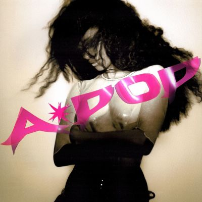

import { Slider, Button } from "@carbon/react";
import { ArrowUpRight } from "@carbon/icons-react";

import SliderJS1 from "../review/slider1";
import SliderJS2 from "../review/slider2";
import SliderJS3 from "../review/slider3";
import SliderJS4 from "../review/slider4";
import AdvJS2 from "../review/adv2";
import AdvJS3 from "../review/adv3";

import { Link } from "gatsby";
import Review1 from "../review/tyla1.mdx";

Album Review

<h1 className="h1--no--margin">{props.pageContext.frontmatter.title}</h1>

<Row  className="image-card-group">
	<Column colMd={3} colLg={4} noGutterMdLeft="">
       <ImageCard>

</ImageCard>
	</Column>
	<Column colMd={4} colLg={8} noGutterMdLeft="">
		

			デビュー作となる前作でブレイクし、グラミーをも受賞したTylaの約2年4ヶ月ぶり通算2作目となるスタジオアルバム。
       A*POP』のタイトルには「アフリカの音楽こそがグローバル・ポップである」という主権的なステートメントが込められていて、既存のポップ像に無理に自分を合わせるのではなく「ポップスを自分に適合させる」という姿勢のもと、アフリカン・ポップスターの既成概念を広げることを提示し、南アフリカのアーティストをゲストの中心に迎えることで、自国の音楽史とルーツに深く根を下ろすコンセプトとなっている。
       R&amp;Bや欧米ポップスを土台にしつつ、amapianoやafrobeats、afro-houseといった現代アフリカ音楽を主軸に置いた新感覚のサウンドになっている。
			前作よりタフでカッティングエッジなサウンドと、クールで硬質的なダンスビートが特徴的。前半はダンサブルなポップナンバーの中にダンスホールや、ドリルとUKガラージを融合した実験的なトラックが配されている。後半に進むにつれてポピアーノやamapianoの色調が強まり、南アフリカのルーツへ深く立ち返る構成になっている。
			 南アフリカのアーティスト以外にも、Zara Larssonとのデュエット曲「She Did It Again」が華やかなポップさを添えている。制作陣ではP2JやIan
      Kirkpatrick、Sammy Sosoらがタフで緻密なトラックメイクを手掛けている。
       Tylaのヴォーカルは、吐息を交えたシルキーで柔らかい質感と、懐の深さが魅力で、軽快に跳ねるリズムからソウルフルで力強い歌唱まで自在にコントロールしている。
       ただ、リリックは「アフリカ」という大きなテーマを誇示するのではなく、一人の女性としての素直な感情や恋愛模様に焦点を当てている。
		

		

		  <Button className="button-right-mergin"  href="https://amzn.to/3TppTy3" renderIcon={ArrowUpRight} size='sm' kind='primary'>
  	    amazon.com
  	  </Button>
  	  <Button className="button-right-mergin"  href="https://amzn.to/4yd2Khv" renderIcon={ArrowUpRight} size='sm' kind='secondary'>
  	    amazon.co.jp
  	  </Button>
			<Button className="button-right-mergin"  href="https://apple.co/4xIQ155" renderIcon={ArrowUpRight} size='sm' kind='tertiary'>
  	    apple music
  	  </Button>
		<AdvJS2/>
		

	</Column>
</Row>
<Row >
	<Column colMd={4} colLg={4} noGutterMdLeft="">
		

		  <h3>Score card</h3>
			<SliderJS1 value="5" />
		  <SliderJS2 value="3" />
			<SliderJS3 value="1" />
		  <SliderJS4 value="9" />
		

	</Column>
	<Column colMd={4} colLg={8} noGutterMdLeft="">
		

			<h3>Producers</h3>
			

				P2J and Cole(1,2)
				 P2J and Ian Kirkpatrick(3,11)
				 Sammy Soso, Ari PenSmith, Believve and Mocha Bands(4,10)
				 Jonathan &quot;Ziyon&quot; Hamilton and Thabo &quot;Ryzor&quot; Shokgold(5)
				 P2J, DAMEDAME*(6)
				 P2J, Sucuki and LOOF(7)
				 P2J and Akeel(8)
				 Sammy Soso(9,14)
				 P2J(12)
				 The Elements(13)
			

			<h3>Guests</h3>
			

				Liquideep, Zara Larsson, MaWhoo, Babalwa
			

		

	</Column>
</Row>

<h3>Tracks</h3>

| No. | Title            | Composers                                                                                                                                                      | Performer               | Time |
| --- | ---------------- | -------------------------------------------------------------------------------------------------------------------------------------------------------------- | ----------------------- | ---- |
| 1   | IS IT LOVE       | Richard Isong, Cole Ostrin, Bibi Bourelly, Tyla Seethal, Douglas Ford                                                                                          | Tyla                    | 3:07 |
| 2   | THAT GIRL        | Tyla Seethal, Richard Isong, Cole Ostrin, Douglas Ford, Bibi Bourelly                                                                                          | Tyla                    | 2:56 |
| 3   | KISS             | Tyla Seethal, Ian Kirkpatrick, Richard Isong, Douglas Ford, Bibi Bourelly                                                                                      | Tyla                    | 3:20 |
| 4   | IS IT            | Tyla Seethal, Samuel Awuku, Ariowa Irosogie, Imani Lewis, Kaine, Corey Marlon Lindsay-Keay                                                                     | Tyla                    | 2:44 |
| 5   | FAIRYTALE        | Jonathan Christian Hamilton                                                                                                                                    | Tyla feat. Liquideep    | 3:28 |
| 6   | DOUBLE BLIND     | Tyla Seethal, Richard Isong, Barbara Boko, Edith Nelson                                                                                                        | Tyla                    | 2:28 |
| 7   | FEEL SOMETHING   | Tyla Seethal, Richard Isong, Tim Friedrich, Louis Leibfried, Jason Boyd                                                                                        | Tyla                    | 3:32 |
| 8   | RIGHT NOW        | Tyla Seethal, Richard Isong, Akeel Henry, Douglas Ford, Jason Boyd, Bibi Bourelly                                                                              | Tyla                    | 3:05 |
| 9   | MR. NONCHALANT   | Tyla Seethal, Samuel Awuku, Imani Lewis, Ariowa Irosogie, Corey Marlon Lindsay-Keay                                                                            | Tyla                    | 2:17 |
| 10  | SHE DID IT AGAIN | Zara Larsson, Tyla Seethal, Samuel Awuku, Ariowa Irosogie, Imani Lewis, Corey Marlon Lindsay-Keay, Uzoechi Emenike, Zikai, Helena Gao, Zara Larsson            | Tyla feat. Zara Larsson | 3:33 |
| 11  | CHANEL           | Ian Kirkpatrick, Douglas Ford, Bibi Bourelly, Richard Isong, Tyla Seethal                                                                                      | Tyla                    | 3:08 |
| 12  | CRAZY OF ME      | Tyla Seethal, Richard Isong, Douglas Ford, Bibi Bourelly, Samuel Awuku, Imani Lewis, Ariowa Irosogie, Corey Marlon Lindsay-Keay, Thandeka Ngema, Stacey Bereng | Tyla feat. MaWhoo       | 4:12 |
| 13  | I DON&#39;T CARE | Tyla Seethal, Keven Wolfsohn, Paul Bogumil Goller, Dayo Olatunji, Babalwa Mavuso                                                                               | Tyla feat. Babalwa M    | 3:12 |
| 14  | HOT TUBS         | Tyla Seethal, Samuel Awuku, Imani Lewis, Ariowa Irosogie, Corey Marlon Lindsay-Keay                                                                            | Tyla                    | 2:57 |

<h3>Other Reviews</h3>

<Row>
  <Column colMd={3} colLg={3} noGutterMdLeft>
    <Review1 />
  </Column>
</Row>

<AdvJS3 />
