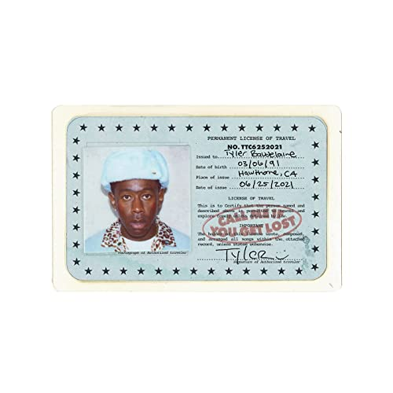

import { Slider, Button } from "carbon-components-react";
import { ArrowUpRight24 } from "@carbon/icons-react";

import SliderJS1 from "../review/slider1";
import SliderJS2 from "../review/slider2";
import SliderJS3 from "../review/slider3";
import SliderJS4 from "../review/slider4";
import AdvJS2 from "../review/adv2";
import AdvJS3 from "../review/adv3";

import { Link } from "gatsby";

import Review1 from "../review/tyler4.mdx";
import Review2 from "../review/tyler3.mdx";

Album review

<h1 className="h1--no--margin">{props.pageContext.frontmatter.title}</h1>

  <Link to="/best50/2021/">2021 Black Music Best No.2</Link>

<Row  className="image-card-group">
	<Column colMd={"3"} colLg={"4"} noGutterMdLeft="">
       <ImageCard>

</ImageCard>
	</Column>
	<Column colMd={"4"} colLg={"8"} noGutterMdLeft="">
	

		前作ではGrammyも獲得し、現代Hip-Hopにおける最重要人物の一人となっているTyler, The Creatorの2年振り6作目。その高評価だった前作と、全体感はそうは変わらないが、唄からRapへと軸足を戻したのが最大の特徴となっている。
		 また、DJ Dramaが各所で煽りを入れていて、彼のMix TapeシリーズのGangsta Grillzへのオマージュであることも判る。
		 Trackはホラーな部分も少し残っているが、全般的にはメローで、Fluteを使った曲などノスタルジックなものが多く、リラックスした印象を受ける。Lyricでは、これまでと打って変わって、成功した自分をテーマにした曲が多い。
		 Rapのほうは撚れたというか惚けたというかで、こちらは今まで通りだ。
	

	

	  <Button className="button-right-mergin"  href="https://amzn.to/3lGwf8M" kind="primary" size="small" renderIcon={ArrowUpRight24}>
      amazon.com
    </Button>
    <Button className="button-right-mergin"  href="https://amzn.to/3s0XTif" kind="secondary" size="small" renderIcon={ArrowUpRight24}>
      amazon.co.jp
    </Button>
		<Button className="button-right-mergin"  href="https://geo.music.apple.com/us/album/call-me-if-you-get-lost/1573484415?itsct=music_box_link&itscg=30200&at=11lcug&ct=albums_call_me_if_you_get_lost&ls=1&app=music" kind="tertiary" size="small" renderIcon={ArrowUpRight24}>
      apple music
    </Button>
		<AdvJS2/>
	

	</Column>
</Row>
<Row >
	<Column colMd={"4"} colLg={"4"} noGutterMdLeft="">
		

    	<h3>Score card</h3>
			<SliderJS1 value="2" />
    	<SliderJS2 value="1" />
			<SliderJS3 value="1" />
    	<SliderJS4 value="9" />
		

	</Column>
	<Column colMd={"8"} colLg={"8"} noGutterMdLeft="">
		

			<h3>Producers</h3>
			

				Tyler, The Creator(1,2,3,4,5,6,7,8,9,10,11,13,14,15)
				 Tyler, The Creator and Jamie xx(12)
				 Tyler, The Creator and Jay Versace(16)
			

			<h3>Guests</h3>
			

				DJ Drama, 42 Dogg, YoungBoy Never Broke Again, Ty Dolla $ign, Lil Wayne, Teezo Touchdown, Domo Genesis, Brent Faiyaz, Fana Hues, Daisy World, Lil Uzi Vert, Pharrell Williams
			

		

	</Column>
</Row>

<h3>Tracks</h3>

| No. | Title                               | Composers                                                                                                                         | Performer                                                          | Time  |
| --- | ----------------------------------- | --------------------------------------------------------------------------------------------------------------------------------- | ------------------------------------------------------------------ | ----- |
| 1   | SIR BAUDELAIRE                      | Billy Cobham / Tyler Okonma                                                                                                       | Tyler, The Creator feat. DJ Drama                                  | 01:28 |
| 2   | CORSO                               | James Asher / Tyler Okonma                                                                                                        | Tyler, The Creator                                                 | 02:26 |
| 3   | LEMONHEAD                           | Dion Hayes / Tyler Okonma                                                                                                         | Tyler, The Creator feat. 42 Dogg                                   | 02:10 |
| 4   | WUSYANAME                           | Solomon Conner / Delando Connor / Kentrell Gaulden / Tyrone Griffin / Darryl Jackson / Tyler Okonma / Bishop "Slick" Burrell, Sr. | Tyler, The Creator feat. YoungBoy Never Broke Again, Ty Dolla $ign | 02:01 |
| 5   | LUMBERJACK                          | Anthony Berkeley / Robert Diggs / Arnold Hamilton / Paul Huston / Tyler Okonma / Larry Willis                                     | Tyler, The Creator                                                 | 02:18 |
| 6   | HOT WIND BLOWS                      | Dwayne Carter / Norman Gimbel / Henry Mancini / Tyler Okonma                                                                      | Tyler, The Creator feat. Lil Wayne                                 | 02:35 |
| 7   | MASSA                               | Tyler Okonma                                                                                                                      | Tyler, The Creator                                                 | 03:43 |
| 8   | RUNITUP                             | Tyler Okonma / Aaron Thomas                                                                                                       | Tyler, The Creator feat. Teezo Touchdown                           | 03:49 |
| 9   | MANIFESTO                           | Dominique Cole / Tyler Okonma / Barry White                                                                                       | Tyler, The Creator feat. Domo Genesis                              | 02:55 |
| 10  | SWEET/I THOUGHT YOU WANTED TO DANCE | Fil Callender / Fana Hues / Tyler Okonma / Christopher Wood                                                                       | Tyler, The Creator feat. Brent Faiyaz, Fana Hues                   | 09:48 |
| 11  | MOMMA TALK                          |                                                                                                                                   | Tyler, The Creator                                                 | 01:10 |
| 12  | RISE!                               | Daisy Hamel-Buffa / Tyler Okonma / James Smith                                                                                    | Tyler, The Creator feat. Daisy World                               | 03:23 |
| 13  | BLESSED                             | Tyler Okonma                                                                                                                      | Tyler, The Creator                                                 | 00:57 |
| 14  | JUGGERNAUT                          | Tyler Okonma / Pharrell Williams / Symere Woods                                                                                   | Tyler, The Creator feat. Lil Uzi Vert, Pharrell Williams           | 02:26 |
| 15  | WILSHIRE                            | Tyler Okonma                                                                                                                      | Tyler, The Creator                                                 | 08:35 |
| 16  | SAFARI                              | Jay Gunter / Tyler Okonma                                                                                                         | Tyler, The Creator                                                 | 02:57 |

<h3>Other Reviews</h3>

<Row>
  <Column colMd={3} colLg={3} noGutterMdLeft>
    <Review1 />
  </Column>
  <Column colMd={3} colLg={3} noGutterMdLeft>
    <Review2 />
  </Column>	
</Row>

<AdvJS3/>

