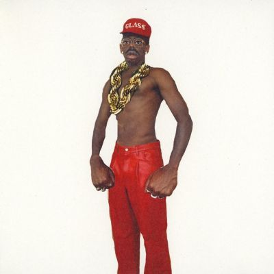

import { Slider, Button } from "@carbon/react";
import { ArrowUpRight } from "@carbon/icons-react";

import SliderJS1 from "../review/slider1";
import SliderJS2 from "../review/slider2";
import SliderJS3 from "../review/slider3";
import SliderJS4 from "../review/slider4";
import AdvJS2 from "../review/adv2";
import AdvJS3 from "../review/adv3";

import { Link } from "gatsby";

import Review1 from "../review/tyler6.mdx";
import Review2 from "../review/tyler5.mdx";
import Review3 from "../review/tyler4.mdx";
import Review4 from "../review/tyler3.mdx";

Album review

<h1 className="h1--no--margin">{props.pageContext.frontmatter.title}</h1>

<Row  className="image-card-group">
	<Column colMd={3} colLg={4} noGutterMdLeft="">
       <ImageCard>

</ImageCard>
	</Column>
	<Column colMd={4} colLg={8} noGutterMdLeft="">
		

			今年(2025年)9月の来日前に、突如リリースされたTyler, The Creatorの8作目。前作より9か月というかなり短いインターバルでのリリースとなったが、その分、30分強の短めのアルバムになっている。
			 コンセプチャルであった前作とは作風も大きく変わっていて、ダンサブルで聴き易いPopな曲がそろっている。このあたり、①にSk8brdという名前で参加しているPharrellの影響が大きい気もする。
			 80年代のディスコ、ファンク、ハウスを下敷きにしたような曲がほとんどではあるが、そのものではなく、Tylerらしい捻じれた感覚が加わっている。また、多くの曲で本人のVocalも聴くことができる。
			 単独プロデュースで、これだけのアルバムを作ってしまうとは、Creatorをアーティスト名に持つのも伊達じゃないと思う。
		

		

		  <Button className="button-right-mergin"  href="https://amzn.to/3JyXoZR" renderIcon={ArrowUpRight} size='sm' kind='primary'>
  	    amazon.com
  	  </Button>
  	  <Button className="button-right-mergin"  href="https://amzn.to/4nAy9Ew" renderIcon={ArrowUpRight} size='sm' kind='secondary'>
  	    amazon.co.jp
  	  </Button>
			<Button className="button-right-mergin"  href="https://apple.co/3WBz4cO" renderIcon={ArrowUpRight} size='sm' kind='tertiary'>
  	    apple music
  	  </Button>
			<AdvJS2/>
		

	</Column>
</Row>
<Row >
	<Column colMd={4} colLg={4} noGutterMdLeft="">
		

    	<h3>Score card</h3>
			<SliderJS1 value="3" />
    	<SliderJS2 value="1" />
			<SliderJS3 value="1" />
    	<SliderJS4 value="10" />
		

	</Column>
	<Column colMd={8} colLg={8} noGutterMdLeft="">
		

			<h3>Producers</h3>
			

				Tyler, The Creator(all)
			

			<h3>Guests</h3>
			

				Sk8brd, Madison McFerrin, Yebba
			

		

	</Column>
</Row>

<h3>Tracks</h3>

| No. | Title                           | Composers                                                                                                                                                                                                                                   | Performer                                 | Time  |
| --- | ------------------------------- | ------------------------------------------------------------------------------------------------------------------------------------------------------------------------------------------------------------------------------------------- | ----------------------------------------- | ----- |
| 1   | Big Poe                         | Tyler Okonma, Pharrell Williams, Shye Ben Tzur - שי בן צור, Busta Rhymes, Nile Rodgers, Sandy Linzer, Q-Tip, Phife Dawg, James Jackson, Denny Randell, Vizions, Bernard Edwards, Charlie Brown, Chad Hugo, Nottz, Jonny Greenwood, Mystikal | Tyler, The Creator feat. Sk8brd           | 03:02 |
| 2   | Sugar On My Tongue              | Tyler Okonma                                                                                                                                                                                                                                | Tyler, The Creator                        | 02:33 |
| 3   | Sucka Free                      | Tyler Okonma                                                                                                                                                                                                                                | Tyler, The Creator                        | 02:41 |
| 4   | Mommanem                        | Tyler Okonma, Nicholas Deinhardt, 2raumwohnung                                                                                                                                                                                              | Tyler, The Creator                        | 01:15 |
| 5   | Stop Playing With Me            | Tyler Okonmaa, Nicholas Deinhardt, 2raumwohnung                                                                                                                                                                                             | Tyler, The Creator                        | 02:13 |
| 6   | Ring Ring Ring                  | Tyler Okonma, Ray Parker Jr.                                                                                                                                                                                                                | Tyler, The Creator                        | 03:21 |
| 7   | Don't Tap That Glass / Tweakin' | Tyler Okonma, Too $hort, Tommy Wright III                                                                                                                                                                                                   | Tyler, The Creator                        | 03:42 |
| 8   | Don't You Worry Baby            | Tyler Okonma, Madison McFerrin, 12 Gauge, Carlos Morgan,& Robert “Flash” Gordon                                                                                                                                                             | Tyler, The Creator feat. Madison McFerrin | 02:58 |
| 9   | I'll Take Care of You           | Tyler Okonma, Yebba, M.I.G., Killa C, Diamond, Princess, Darnell “Breakbread Tay” Henderson, Lil Scrappy, Lil Jay, Doc Jam, Brook Benton, Syd                                                                                               | Tyler, The Creator feat. Yebba            | 03:20 |
| 10  | Tell Me What It is              | Tyler Okonma                                                                                                                                                                                                                                | Tyler, The Creator                        | 03:22 |

<h3>Other Reviews</h3>

<Row>
  <Column colMd={3} colLg={3} noGutterMdLeft>
    <Review1 />
  </Column>
  <Column colMd={3} colLg={3} noGutterMdLeft>
    <Review2 />
  </Column>
  <Column colMd={3} colLg={3} noGutterMdLeft>
    <Review3 />
  </Column>
	<Column colMd={3} colLg={3} noGutterMdLeft>
    <Review4 />
  </Column>
</Row>

<AdvJS3 />
