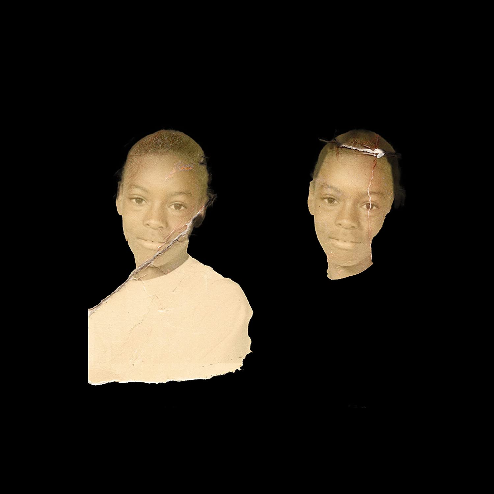

import { Slider, Button } from "@carbon/react";
import { ArrowUpRight } from "@carbon/icons-react";

import SliderJS1 from "../review/slider1";
import SliderJS2 from "../review/slider2";
import SliderJS3 from "../review/slider3";
import SliderJS4 from "../review/slider4";
import AdvJS2 from "../review/adv2";
import AdvJS3 from "../review/adv3";

import { Link } from "gatsby";

import Review1 from "../review/vincestaples5.mdx";
import Review2 from "../review/vincestaples4.mdx";
import Review3 from "../review/vincestaples3.mdx";

Album review

<h1 className="h1--no--margin">{props.pageContext.frontmatter.title}</h1>

  <Link to="/best50/2022/">2022 Black Music Best No.7</Link>

<Row  className="image-card-group">
	<Column colMd={3} colLg={4} noGutterMdLeft="">
       <ImageCard>

</ImageCard>
	</Column>
	<Column colMd={4} colLg={8} noGutterMdLeft="">
		

			昨年に引き続きのリリースとなるVince Staplesの5作目。タイトルにあるRamona Parkとは、Vinceの生まれ育ったLong Beachにある公園のことで、これからも判るように自身の半生や思い出などを描いたPersonalな作品となっており、この辺は前作に近い。ただ、前々作、前作では、Kenny Beatsが制作をほぼ担っていたが、当作では多くのPeoducer陣が参加している。
			 サウンドは、メランコリックでエモーショナルなトーンで統一されており、メロディックで美しいトラックも多く、ちょっと感傷的な気分にさせる。
		

		

		  <Button className="button-right-mergin"  href="https://amzn.to/3ZjjxhK" renderIcon={ArrowUpRight} size='sm' kind='primary'>
  	    amazon.com
  	  </Button>
  	  <Button className="button-right-mergin"  href="https://amzn.to/3VW7B2H" renderIcon={ArrowUpRight} size='sm' kind='secondary'>
  	    amazon.co.jp
  	  </Button>
			<Button className="button-right-mergin"  href="https://apple.co/3GPo8RA" renderIcon={ArrowUpRight} size='sm' kind='tertiary'>
  	   	apple music
  	  </Button>
			<AdvJS2/>
		

	</Column>
</Row>
<Row >
	<Column colMd={4} colLg={4} noGutterMdLeft="">
		

		  <h3>Score card</h3>
			<SliderJS1 value="1" />
		  <SliderJS2 value="2" />
			<SliderJS3 value="2" />
		  <SliderJS4 value="8" />
		

	</Column>
	<Column colMd={8} colLg={8} noGutterMdLeft="">
		

			<h3>Producers</h3>
			

				Mingo(1,16)
				 LeKen Taylor(2)
				 Dahi(3,9)
				 DJ Mustard(4)
				 Brazzen(5)
				 Frano(6)
				 Kenny Beats and Reske(7)
				 Zack Sekoff and Mike Hector(8)
				 LeKen Taylor and Yori(10)
				 Saint Mino, Jonas and LBAMBINO(11)
				 Nami and Coop The Truth(12)
				 Mustard, Cardo & Johnny Juliano(13)
				 Saint Mino and Tommy Parker(14,15)
			

			<h3>Guests</h3>
			

				Mustard, Lil Baby, Ty Dolla $ign
			

		

	</Column>
</Row>

<h3>Tracks</h3>

| No. | Title                      | Composers                                                                                                                                                                     | Performer                         | Time  |
| --- | -------------------------- | ----------------------------------------------------------------------------------------------------------------------------------------------------------------------------- | --------------------------------- | ----- |
| 1   | The Beach                  | Vincent Staples, Thibault Dominguez                                                                                                                                           | Vince Staples                     | 01:07 |
| 2   | Aye! (Free the Homies)     | Vincent Staples, LeKen Taylo, Zack Sekoff, Sean Matsukawa                                                                                                                     | Vince Staples                     | 03:05 |
| 3   | DJ Quik                    | Vincent Staples, Dacoury Dahi Natche, Cooper McGill, Dylan Ismael Teixeira, David Marvin Blake, Dewey Wilson, Earl E. Washington, John Sims, Luther Cook, R. Brooks, R. Smith | Vince Staples                     | 02:20 |
| 4   | Magic                      | Vincent Staples, Dijon McFarlane, Nicholas Audino, Lewis Hughes, Jacob Wilkinson-Smith, Theodore Life, Dexter Wansel                                                          | Vince Staples feat: Mustard       | 03:45 |
| 5   | Nameless                   | Vincent Staples, Grecia Alfaro, Dylan Wiggins                                                                                                                                 | Vince Staples                     | 00:48 |
| 6   | When Sparks Fly            | Vincent Staples, Frano Huett, Francesca Bergami, Atupele Ndisale, Shahrooz Raoofi                                                                                             | Vince Staples                     | 03:47 |
| 7   | East Point Prayer          | Vincent Staples, Kenneth Charles Blume III, Jacob Reske, Dominique Jones, Arthur Ray                                                                                          | Vince Staples feat: Lil Baby      | 03:37 |
| 8   | Slide                      | Vincent Staples, LeKen Taylor, Zack Sekoff, Mike Hector, Hebrew Malachai Richardson                                                                                           | Vince Staples                     | 02:17 |
| 9   | Papercuts                  | Vincent Staples, Dacoury Dahi Natche, Paul Castelluzzo                                                                                                                        | Vince Staples                     | 03:01 |
| 10  | Lemonade                   | Vincent Staples, LeKen Taylor, Joseph Luis Ramirez III, Yori Smith, Tyrone Griffin                                                                                            | Vince Staples feat: Ty Dolla $ign | 02:59 |
| 11  | Player Ways                | Vincent Staples, Mino Drerup, Levi Miucci, Jonas Koch, Dylan Ismael Teixeira, Corinne Bailey Rae                                                                              | Vince Staples                     | 03:28 |
| 12  | Mama's Boy                 | Vincent Staples, Dylan Ismael Teixeira, Cooper McGill                                                                                                                         | Vince Staples                     | 02:19 |
| 13  | Bang That                  | Vincent Staples, Dijon McFarlane, John Julian, Ron Latour                                                                                                                     | Vince Staples feat: Mustard       | 02:39 |
| 14  | The Spirit of Monster Kody | Vincent Staples, Thomas Westly Lumpkins, Mino Drerup                                                                                                                          | Vince Staples                     | 00:45 |
| 15  | Rose Street                | Vincent Staples, Mino Drerup, Thomas Westly Lumpkins                                                                                                                          | Vince Staples                     | 02:33 |
| 16  | The Blues                  | Vincent Staples, Dominguez Thibault                                                                                                                                           | Vince Staples                     | 02:22 |

<Row>
  <Column colMd={3} colLg={3} noGutterMdLeft>
    <Review1 />
  </Column>
  <Column colMd={3} colLg={3} noGutterMdLeft>
    <Review2 />
  </Column>
  <Column colMd={3} colLg={3} noGutterMdLeft>
    <Review3 />
  </Column>
</Row>

<AdvJS3 />
