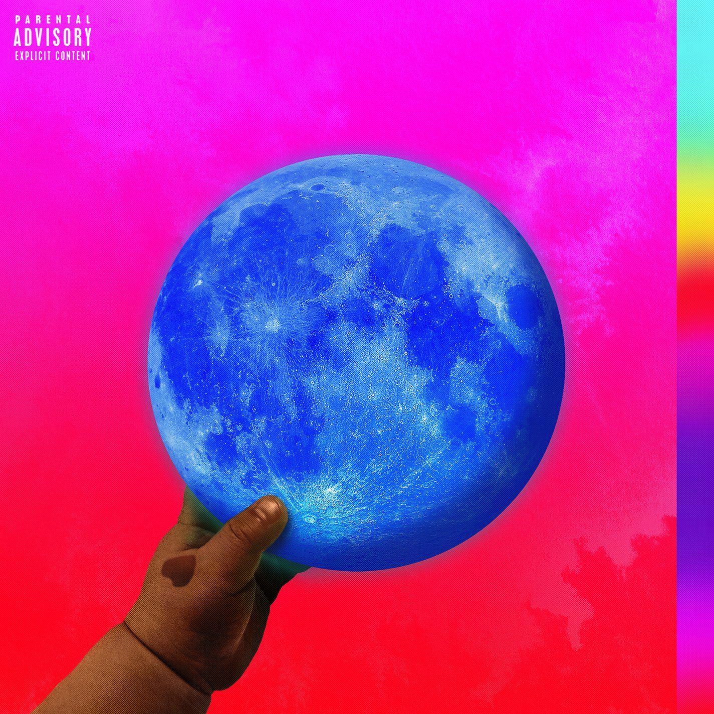

import { Slider, Button } from 'carbon-components-react';
import { ArrowUpRight24  } from '@carbon/icons-react';

import SliderJS1 from "../review/slider1"
import SliderJS2 from "../review/slider2"
import SliderJS3 from "../review/slider3"
import SliderJS4 from "../review/slider4"

import { Link } from "gatsby"

Album review

<h1 className="h1--no--margin">{props.pageContext.frontmatter.title}</h1>

<Row  className="image-card-group">
	<Column colMd={"3"} colLg={"4"} noGutterMdLeft="">
       <ImageCard>

 

</ImageCard>
	</Column>
	<Column colMd={"4"} colLg={"8"} noGutterMdLeft="">
	

	Waleの2年ぶり5作目。Producerはほぼ一新されたが、全体感としては前作からの流れを踏襲している。冒頭では唄中心かと思ったが、後半はRapに比重を移している。それにしてもバラエティに富んだ作品で、アンビエント、ラテン、サウス、ストレートなHip-Hop、Popな曲、スローでメローな曲と様々。曲ごとにProducerが違って、Guestも多数ではあるが、散漫になることなく、凝った曲が多くただただ面白い。ゆるめのだみ声Rapも相変わらずで、味わい深く聴けます。
	

	

	  <Button className="button-right-mergin"  href="https://amzn.to/2XmyAJj" kind="primary" size="small" renderIcon={ArrowUpRight24}>
      amazon.com
    </Button>
		<Button className="button-right-mergin"  href="https://amzn.to/2XmbN05" kind="secondary" size="small" renderIcon={ArrowUpRight24}>
      amazon.co.jp
    </Button>
	

	
	</Column>
</Row>
<Row >
	<Column colMd={"4"} colLg={"4"} noGutterMdLeft="">

  <h3>Score card</h3>
	<SliderJS1 value="3" />
  <SliderJS2 value="1" />
	<SliderJS3 value="1" />
  <SliderJS4 value="9" />

</Column>
<Column colMd={"8"} colLg={"8"} noGutterMdLeft="">

<h3>Producers</h3>

Cool & Dre(1)
 Spinz Beats(2)
 Go Grizzly & Dreamlife(3)
 Diplo and Picard Brothers(4)
 Christian Rich(5)
 Don Cannon(6)
 Ced(7)
 Kane Beatz(8)
 Nez & Rio(9)
 Marce Reazon(10)
 Super Miles(11)
 The Dope Boyz(12)
 Lee Major(13)
 Pro Reese(14)

<h3>Guests</h3>

	Lil' Wayne, Major Lazer, Wizkid, Dua Lipa, G-Easy, J Balvin, Travis Scott, Davido, Olamide, Chris Brown, Phil Ade, Zyla Moon, August Grant

</Column>
</Row>

<h3>Tracks</h3>

| No. |	 Title                      |	 Composers                                                                                                                 	|	 Performer                               | Time	 |
| --- |	--------------------------- | --------------------------------------------------------------------------------------------------------------------------- | ---------------------------------------- | ----- |
|	1	  |	Thank God                   | Olubowale Akintimehin / Andre Lyon / Larry Mizell / Bryan Sledge / Marcello Valenzano                                      	|	Wale                                     | 03:10 |
|	2	  |	Running Back                | Olubowale Akintimehin / Dwayne Carter / Daniel Forrest                                                                     	|	Wale feat. Lil' Wayne                    | 03:35 |
|	3	  |	Scarface Rozay Gotti        | Olubowale Akintimehin / Jan Richard Branicki / Kevin Price                                                                 	|	Wale                                     | 05:02 |
|	4	  |	My Love                     | Olubowale Akintimehin / Clement Jacques / Thomas Wesley Pentz / Maxime Picard                                              	|	Wale feat. Major Lazer, Wizkid, Dua Lipa | 03:48 |
|	5	  |	Fashion Week                | Olubowale Akintimehin / Gerald Gillum / Kehinde Hassan / Taiwo Hassan / Ray Jacobs                                         	|	Wale feat. G-Easy                        | 03:57 |
|	6	  |	Colombia Heights (Te Llamo) | Olubowale Akintimehin / Jos? ?lvaro Osorio Balvin / Jason Boyd / Donald Cannon                                             	|	Wale feat. J Balvin                      | 03:47 |
|	7	  |	CC White                    | Olubowale Akintimehin / Cedric Brown / Hod David / Menard Maxwell Gerald Davis / Big Ghost                                 	|	Wale                                     | 04:14 |
|	8	  |	Mathematics                 | Olubowale Akintimehin / Daniel Johnson                                                                                     	|	Wale                                     | 04:02 |
|	9	  |	Fish N Grits                | Mario Loving / Jacques Webster / Nesbitt Wesonga                                                                           	|	Wale feat. Travis Scott                  | 02:57 |
|	10	|	Fine Girl                   | Olamide Adedeji / David Adedeji Adeleke / Olubowale Akintimehin / James Harris / Terry Lewis / Marce Reazon / Zachary Young	|	Wale feat. Davido, Olamide               | 04:35 |
|	11	|	Heaven on Earth             | Philip Adetumbi / Olubowale Akintimehin / Christopher Braide / Chris Brown / Miles Franklin / Yuna Zarrai                  	|	Wale feat. Chris Brown                   | 03:47 |
|	12	|	MY PYT                      | Olubowale Akintimehin / Odell Brown / Marvin Gaye / James Ingram / Quincy Jones / Jamel Nelson / David Ritz / Andrew Sanon 	|	Wale                                     | 03:56 |
|	13	|	DNA                         | Olubowale Akintimehin / Donald Degrate / Leigh Elliott / Johnny Mollings / Lenny Mollings / Sean Momberger                 	|	Wale                                     | 03:44 |
|	14	|	Smile                       | Philip Adetumbi / Olubowale Akintimehin / Maurice Earl Barnett-Fenderson / Arthur Ross / Leon Ware                         	|	Wale feat. Phil Ade, Zyla Moon           | 04:46 |
