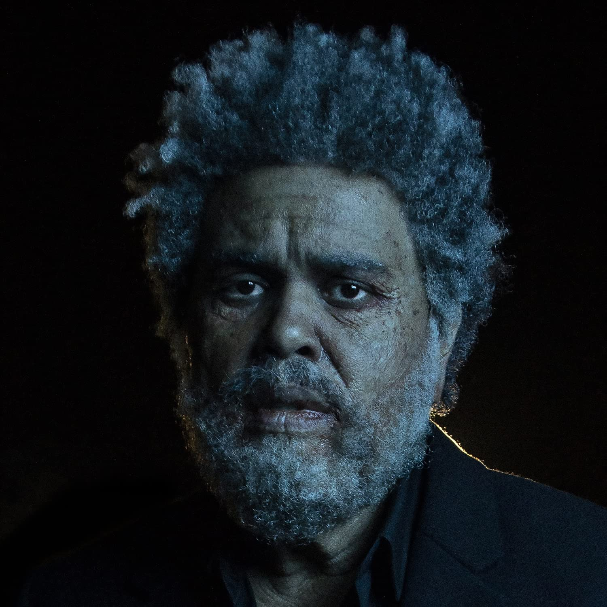

import { Slider, Button } from "@carbon/react";
import { ArrowUpRight } from "@carbon/icons-react";

import SliderJS1 from "../review/slider1";
import SliderJS2 from "../review/slider2";
import SliderJS3 from "../review/slider3";
import SliderJS4 from "../review/slider4";
import AdvJS2 from "../review/adv2";
import AdvJS3 from "../review/adv3";

import { Link } from "gatsby";

import Review1 from "../review/weeknd6.mdx";
import Review2 from "../review/weeknd5.mdx";
import Review3 from "../review/weeknd4.mdx";

Album review

<h1 className="h1--no--margin">{props.pageContext.frontmatter.title}</h1>

<Row  className="image-card-group">
	<Column colMd={3} colLg={4} noGutterMdLeft="">
       <ImageCard>

</ImageCard>
	</Column>
	<Column colMd={4} colLg={8} noGutterMdLeft="">
		

			The Weekndの2年弱ぶりのアルバム。世相にマッチして好評だった前作の勢いを切らさずに、適度なインターバルでのリリースとなっている。タイトルにあるように架空のFM局"Dawn FM"による番組風になっていて、曲間をActorのJim Careyなどのナレーションによって、切れ目なく繋ぐ構成になっている。
			 制作陣は前作からMetro Boominが抜けたくらいで、ほぼ変わらず、80年代的なシンセ全開のElectro Popが多くを占めている。
			 Blue Eyed Soulっぽい曲では、黒人のWeekndから、白人のほうに寄せているところがユニークで、黒人音楽の系譜とは別のところから現れた人ならではの自由さな気がする。
			 高音Vocalでのさわやかな曲も少なくないが、特に、シングルカットされた流麗なスロー曲の⑥では亜蘭知子さんのMidnight Pretendorsのループが一曲通してサンプリングされており、日本人としては気になるところでもある。暗闇の先にDawn(夜明け)が来るよという今の時代への愛とメッセージを込めた作品でもある。
		

		

		  <Button className="button-right-mergin"  href="https://amzn.to/3F30u1l" renderIcon={ArrowUpRight} size='sm' kind='primary'>
  	    amazon.com
  	  </Button>
  	  <Button className="button-right-mergin"  href="https://amzn.to/3MJY2jd" renderIcon={ArrowUpRight} size='sm' kind='secondary'>
  	    amazon.co.jp
  	  </Button>
			<Button className="button-right-mergin"  href="https://apple.co/3KpvOst" renderIcon={ArrowUpRight} size='sm' kind='tertiary'>
      	apple music
    	</Button>
			<AdvJS2/>
		

	</Column>
</Row>
<Row >
	<Column colMd={4} colLg={4} noGutterMdLeft="">
		

		  <h3>Score card</h3>
			<SliderJS1 value="5" />
		  <SliderJS2 value="1" />
			<SliderJS3 value="1" />
		  <SliderJS4 value="9" />
		

	</Column>
	<Column colMd={8} colLg={8} noGutterMdLeft="">
		

			<h3>Producers</h3>
			

				Oscar Holter, Max Martin, OPN and The Weeknd(1,2,3,11,13,16)
				 Oscar Holter, Max Martin and The Weeknd(4,15)
				 Oscar Holter, Max Martin, Swedish House Mafia and The Weeknd(5)
				 Jeff Gitty, Max Martin, OPN and The Weeknd(6)
				 OPN and The Weeknd(7)
				 Benny Bock, Charlie Coffeen, Bruce Johnston, Brian Kennedy, Rex Kudo, Max Martin and The Weeknd(8)
				 DaHeala, Oscar Holter, Max Martin and The Weeknd(9)
				 Oscar Holter, Peter Lee Johnson, Max Martin, OPN, Tommy Brown and The Weeknd(10)
				 Max Martin, OPN and The Weeknd(12)
				 Calvin Harris, Oscar Holter, Max Martin and The Weeknd(14)
			

			<h3>Guests</h3>
			

				Lil Wayne, Tyler, the Creator
			

		

	</Column>
</Row>

<h3>Tracks</h3>

| No. | Title                      | Composers                                                                                                                  | Performer                           | Time  |
| --- | -------------------------- | -------------------------------------------------------------------------------------------------------------------------- | ----------------------------------- | ----- |
| 1   | Dawn FM                    | Abel Tesfaye, Daniel Lopatin                                                                                               | The Weeknd                          | 01:36 |
| 2   | Gasoline                   | Abel Tesfaye, Daniel Lopatin                                                                                               | The Weeknd                          | 03:32 |
| 3   | How Do I Make You Love Me? | Abel Tesfaye, Steve Angello, Matt Cohn, Axel Hedfors, Oscar Holter, Sebastian Ingrosso, Daniel Lopatin, Max Martin         | The Weeknd                          | 03:34 |
| 4   | Take My Breath             | Abel Tesfaye , Ahmad Balshe, Oscar Holter, Max Martin                                                                      | The Weeknd                          | 05:39 |
| 5   | Sacrifice                  | Abel Tesfaye, Steve Angello, Axel Hedfors, Oscar Holter, Sebastian Ingrosso, Kevin Duane McCord, Max Martin, Carl Nordströ | The Weeknd                          | 03:08 |
| 6   | A Tale by Quincy           | Abel Tesfaye, Jeff Gitty, Quincy Jones, Daniel Lopatin                                                                     | The Weeknd                          | 01:36 |
| 7   | Out of Time                | Abel Tesfaye, Daniel Lopatin, Tetsuro Harada, Tomoko Aran                                                                  | The Weeknd                          | 03:34 |
| 8   | Here We Go... Again        | Abel Tesfaye, Benny Bock, Charlie Coffeen, Bruce Johnston, Brian Kennedy, Rex Kudo, Christian Love, Tyler Okonma           | The Weeknd feat. Tyler, the Creator | 03:29 |
| 9   | Best Friends               | Abel Tesfaye, Jason Quenneville                                                                                            | The Weeknd                          | 02:43 |
| 10  | Is There Someone Else?     | Abel Tesfaye, Peter Lee Johnson, Daniel Lopatin, Tommy Brown                                                               | The Weeknd                          | 03:19 |
| 11  | Starry Eyes                | Abel Tesfaye, Peter Lee Johnson, Daniel Lopatin, Tommy Brown                                                               | The Weeknd                          | 02:27 |
| 12  | Every Angel Is Terrifying  | Abel Tesfaye, Matt Cohn, Daniel Lopatin                                                                                    | The Weeknd                          | 02:47 |
| 13  | Don't Break My Heart       | Abel Tesfaye, Matt Cohn, Oscar Holter, Daniel Lopatin, Max Martin                                                          | The Weeknd                          | 03:25 |
| 14  | I Heard You're Married     | Abel Tesfaye, Dwayne Michael Carter, Jr., Daniel Lopatin, Adam Wiles                                                       | The Weeknd feat. Lil Wayne          | 04:23 |
| 15  | Less Than Zero             | Abel Tesfaye, Oscar Holter, Max Martin                                                                                     | The Weeknd                          | 03:31 |
| 16  | Phantom Regret by Jim      | Abel Tesfaye, Jim Carrey, Matt Cohn, Oscar Holter, Daniel Lopatin, Max Martin                                              | The Weeknd                          | 02:59 |

<h3>Other Reviews</h3>

<Row>
  <Column colMd={3} colLg={3} noGutterMdLeft>
    <Review1 />
  </Column>
  <Column colMd={3} colLg={3} noGutterMdLeft>
    <Review2 />
  </Column>
  <Column colMd={3} colLg={3} noGutterMdLeft>
    <Review3 />
  </Column>
</Row>

<AdvJS3 />
