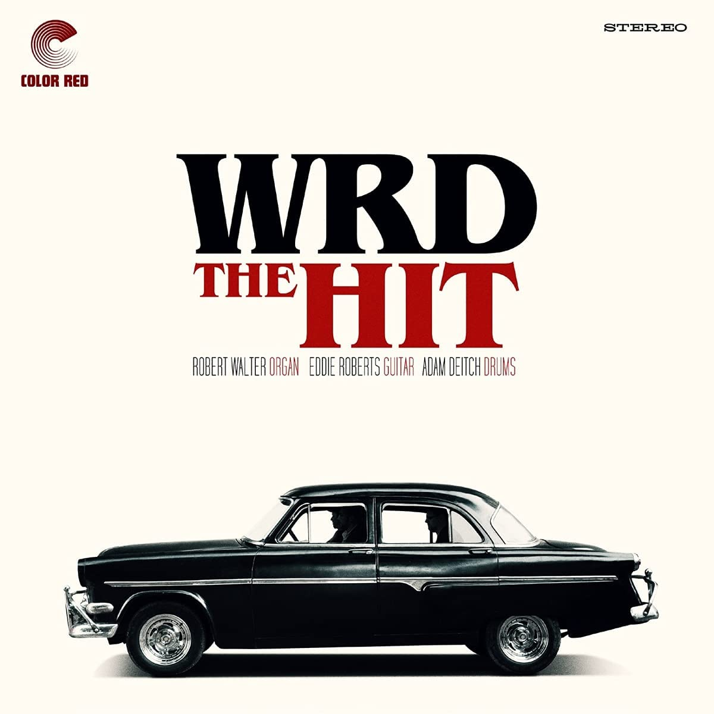

import { Slider, Button } from "carbon-components-react";
import { ArrowUpRight24 } from "@carbon/icons-react";

import SliderJS1 from "../review/slider1";
import SliderJS2 from "../review/slider2";
import SliderJS3 from "../review/slider3";
import SliderJS4 from "../review/slider4";
import AdvJS2 from "../review/adv2";
import AdvJS3 from "../review/adv3";

import { Link } from "gatsby";

Album Review

<h1 className="h1--no--margin">{props.pageContext.frontmatter.title}</h1>

<Row  className="image-card-group">
	<Column colMd={"3"} colLg={"4"} noGutterMdLeft="">
       <ImageCard>

</ImageCard>
	</Column>
	<Column colMd={"4"} colLg={"8"} noGutterMdLeft="">
	

		Greyboy AllstarsのRobert Walter(org), The New MastersoundsのEddie Roberts(g), LettucedのAdam Deitch(ds)によるTrio、WRDの初アルバム。バンド名は3人の頭文字をとったもの。
		 Adam DeitchあたりはHip-Hop Artistとの共演もあったりするが、こちらの作品はヴィンテージ感たっぷりのファンクでソウルフルなものであり、全曲、Insturumentalでの構成であり、曲調もUpでのりのよいものばかりである。
		 高度なテクニックに裏打ちされる3人の演奏が紡ぎだすグルーブが心地よく、ライブハウスで一杯傾けながら、聞けたら、最高だと思う。
		

	

	  <Button className="button-right-mergin"  href="https://amzn.to/2W2VCHJ" kind="primary" size="small" renderIcon={ArrowUpRight24}>
      amazon.com
    </Button>
    <Button className="button-right-mergin"  href="https://amzn.to/3AsHJkW" kind="secondary" size="small" renderIcon={ArrowUpRight24}>
      amazon.co.jp
    </Button>
		<Button className="button-right-mergin"  href="https://geo.music.apple.com/us/album/the-hit-feat-wrd-trio/1551248056?itsct=music_box_link&itscg=30200&at=11lcug&ls=1&app=music" kind="tertidary" size="small" renderIcon={ArrowUpRight24}>
      apple music
    </Button>
		<AdvJS2/>
	

	</Column>
</Row>
<Row >
	<Column colMd={"4"} colLg={"4"} noGutterMdLeft="">
	

	  <h3>Score card</h3>
	  <SliderJS2 value="2" />
		<SliderJS3 value="1" />
	  <SliderJS4 value="8" />
	

</Column>
<Column colMd={"8"} colLg={"8"} noGutterMdLeft="">

	<h3>Producers</h3>
	

		Eddie Roberts(all)
	

	<h3>Guests</h3>
	

	

</Column>
</Row>

<h3>Tracks</h3>

| No. | Title              | Composers                    | Performer | Time  |
| --- | ------------------ | ---------------------------- | --------- | ----- |
| 1   | Judy               | Robert Walter, Eddie Roberts | WRD       | 04:26 |
| 2   | Sleep Depraved     | Robert Walter                | WRD       | 04:17 |
| 3   | Chum City          | Robert Walter, Eddie Roberts | WRD       | 04:30 |
| 4   | Bobby's Boogaloo   | Robert Walter                | WRD       | 03:17 |
| 5   | Poison Dart        | Robert Walter                | WRD       | 05:15 |
| 6   | Red Sunset         | Adam Deitch                  | WRD       | 04:36 |
| 7   | Meditation         | Samuel Henry Jr.             | WRD       | 03:22 |
| 8   | Happy Hour         | Robert Walter                | WRD       | 01:44 |
| 9   | Hot Honey          | Robert Walter                | WRD       | 03:36 |
| 10  | Corner Pocket      | Adam Deitch                  | WRD       | 02:58 |
| 11  | Pump Up The Valium | Robert Walter                | WRD       | 04:34 |

<AdvJS3 />
