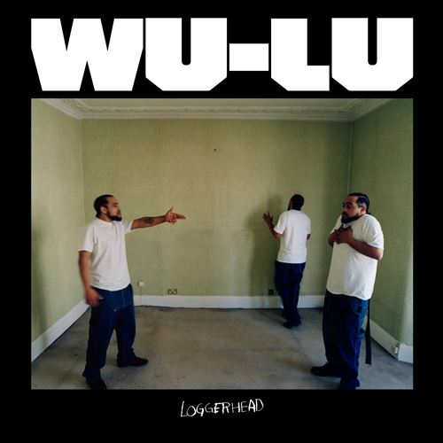

import { Slider, Button } from "@carbon/react";
import { ArrowUpRight } from "@carbon/icons-react";

import SliderJS1 from "../review/slider1";
import SliderJS2 from "../review/slider2";
import SliderJS3 from "../review/slider3";
import SliderJS4 from "../review/slider4";
import AdvJS2 from "../review/adv2";
import AdvJS3 from "../review/adv3";

import { Link } from "gatsby";

Album Review

<h1 className="h1--no--margin">{props.pageContext.frontmatter.title}</h1>

  <Link to="/best50/2022/">2022 Black Music Album Best No.39</Link>

<Row  className="image-card-group">
	<Column colMd={3} colLg={4} noGutterMdLeft="">
       <ImageCard>

</ImageCard>
	</Column>
	<Column colMd={4} colLg={8} noGutterMdLeft="">
		

			South London出身のSinger, Producer, Song Writer, Wu-Luのデビュー作。Flying Lotusなどで知られるWarpよりのリリースとなる。
			 マルチ楽器奏者でもあるようだが、当作ではSong Writng, Produceの専念しており、演奏は仲間に任せている。Drum, Base, GuiterをコアにしたTrackは、Punk, Hip-Hop, Electroなど多岐にわたるジャンルをミックスし、UKっぽいトーンでまぶしたようなサウンドで、結構ハード寄り、かつExperimentalな要素も感じられる。
			 その分、耳障りは良くはないが、大衆におもねっていない潔さは評価できる。
			 唄/Rapは、つぶやくような緩い歌唱が大半を占めている。
		

		

		  <Button className="button-right-mergin"  href="https://amzn.to/3XqK8sL" renderIcon={ArrowUpRight} size='sm' kind='primary'>
  	    amazon.com
  	  </Button>
  	  <Button className="button-right-mergin"  href="https://amzn.to/3XqK8sL" renderIcon={ArrowUpRight} size='sm' kind='secondary'>
  	    amazon.co.jp
  	  </Button>
			<Button className="button-right-mergin"  href="https://apple.co/44lVzUV" renderIcon={ArrowUpRight} size='sm' kind='tertiary'>
  	    apple music
  	  </Button>
			<AdvJS2/>
		

	</Column>
</Row>
<Row >
	<Column colMd={4} colLg={4} noGutterMdLeft="">
		

		  <h3>Score card</h3>
		  <SliderJS1 value="2" />
		  <SliderJS2 value="1" />
			<SliderJS3 value="3" />
		  <SliderJS4 value="8" />
		

</Column>
<Column colMd={8} colLg={8} noGutterMdLeft="">
	

		<h3>Producers</h3>
		

			Wu-Lu(all)
		

		<h3>Guests</h3>
		

			Asha, Lex Amor, Léa Sen
		

	

</Column>
</Row>

<h3>Tracks</h3>

| No. | Title            | Composers                      | Performer            | Time  |
| --- | ---------------- | ------------------------------ | -------------------- | ----- |
| 1   | Take Stage       | Wu-Lu                          | Wu-Lu                | 02:59 |
| 2   | Night Pill       | Asha Lorenz / Wu-Lu            | Wu-Lu feat. Asha     | 03:40 |
| 3   | Facts            | Amon Wale Joseph Brown / Wu-Lu | Wu-Lu feat. Lex Amor | 03:26 |
| 4   | Scrambled Tricks | Wu-Lu                          | Wu-Lu feat. Léa Sen  | 02:22 |
| 5   | South            | Lex Amor / Wu-Lu               | Wu-Lu                | 03:54 |
| 6   | Calo Paste       | Wu-Lu                          | Wu-Lu                | 03:26 |
| 7   | Slightly         | Wu-Lu                          | Wu-Lu                | 03:01 |
| 8   | Blame            | Wu-Lu                          | Wu-Lu                | 03:03 |
| 9   | Ten              | Wu-Lu                          | Wu-Lu                | 01:54 |
| 10  | Road Trip        | Wu-Lu                          | Wu-Lu                | 04:00 |
| 11  | Times            | Wu-Lu                          | Wu-Lu                | 05:18 |
| 12  | Broken Home      | Wu-Lu                          | Wu-Lu                | 04:18 |

<AdvJS3 />
