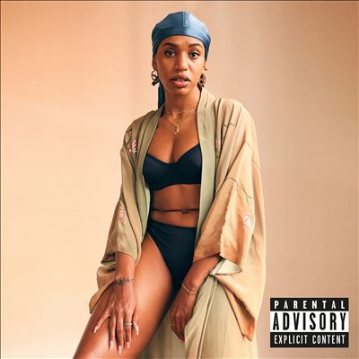

import { Slider, Button } from "@carbon/react";
import { ArrowUpRight } from "@carbon/icons-react";

import SliderJS1 from "../review/slider1";
import SliderJS2 from "../review/slider2";
import SliderJS3 from "../review/slider3";
import SliderJS4 from "../review/slider4";
import AdvJS2 from "../review/adv2";
import AdvJS3 from "../review/adv3";

import { Link } from "gatsby";

Album review

<h1 className="h1--no--margin">{props.pageContext.frontmatter.title}</h1>

  <Link to="/best50/2022/">2022 Black Music Album Best No.23</Link>

<Row  className="image-card-group">
	<Column colMd={3} colLg={4} noGutterMdLeft="">
       <ImageCard>

</ImageCard>
	</Column>
	<Column colMd={4} colLg={8} noGutterMdLeft="">
		

			NY生まれで、DCで活動するSinger, Song Writer、Yaya Bey の初フルレングスアルバム。ほとんどの曲でのProduceも自身でこなしており、パーソナルな作品になっている。
			 全18曲と曲数多めながら、35分と短めなアルバムなので、曲と唄以外の虚飾がそぎ落とされていて、この辺は自家製な所以でありそうだ。
			 サウンドは、オーガニックなNeo Soulという感じで、数曲ではEryka Baduっぽさを感じる。曲調はゆったりとしたものばかりで、抑え気味のYaya BeyのVocalが曲と一体化している。また、Jazzyな曲やレゲエ曲で、ほんの少しバリエーションを加えている。
			 Lyricのほうは恋愛、人間関係、男尊女卑あたりの身の回りのことを唄っているようだ。
			

		

		  <Button className="button-right-mergin"  href="https://amzn.to/3zQojrs" renderIcon={ArrowUpRight} size='sm' kind='primary'>
  	    amazon.com
  	  </Button>
  	  <Button className="button-right-mergin"  href="https://amzn.to/43l7uTd" renderIcon={ArrowUpRight} size='sm' kind='secondary'>
  	    amazon.co.jp
  	  </Button>
			<Button className="button-right-mergin"  href="https://apple.co/3Mv3NnN" renderIcon={ArrowUpRight} size='sm' kind='tertiary'>
  	   	apple music
  	  </Button>
			<AdvJS2/>
		

	</Column>
</Row>
<Row >
	<Column colMd={4} colLg={4} noGutterMdLeft="">
		

		  <h3>Score card</h3>
			<SliderJS1 value="5" />
		  <SliderJS2 value="2" />
			<SliderJS3 value="1" />
		  <SliderJS4 value="9" />
		

	</Column>
	<Column colMd={8} colLg={8} noGutterMdLeft="">
		

			<h3>Producers</h3>
			

				Hadaiyah Bey(1,2,3,4,5,7,8,11,12,13,14,15,17,18)
				 Hadaiyah Bey and Aja Grant(6,9,10)
				 Hadaiyah Bey and Christopher Harris(9)
				 Aja Grant(16)
			

			<h3>Guests</h3>
			

				DJ Nativesun
			

		

	</Column>
</Row>

<h3>Tracks</h3>

| No. | Title                   | Composers                                    | Performer                   | Time  |
| --- | ----------------------- | -------------------------------------------- | --------------------------- | ----- |
| 1   | intro                   | Hadaiyah Bey                                 | Yaya Bey                    | 01:16 |
| 2   | libation                | Hadaiyah Bey                                 | Yaya Bey                    | 00:29 |
| 3   | big daddy ya            | Hadaiyah Bey                                 | Yaya Bey                    | 02:09 |
| 4   | keisha                  | Hadaiyah Bey                                 | Yaya Bey                    | 02:55 |
| 5   | nobody knows            | Hadaiyah Bey                                 | Yaya Bey                    | 03:11 |
| 6   | alright                 | Hadaiyah Bey, Aja Grant                      | Yaya Bey                    | 03:08 |
| 7   | meet me in brooklyn     | Hadaiyah Bey                                 | Yaya Bey                    | 01:29 |
| 8   | it was just a dance     | Hadaiyah Bey                                 | Yaya Bey                    | 00:17 |
| 9   | pour up                 | Hadaiyah Bey, Dre Wilson, Christopher Harris | Yaya Bey feat. DJ Nativesun | 02:05 |
| 10  | uh uh nxgga             | Hadaiyah Bey, Dre Wilson, Christopher Harris | Yaya Bey                    | 00:16 |
| 11  | reprise                 | Hadaiyah Bey                                 | Yaya Bey                    | 04:25 |
| 12  | rolling stoner          | Hadaiyah Bey, Janay Booker                   | Yaya Bey                    | 01:48 |
| 13  | don't fucking call me   | Hadaiyah Bey                                 | Yaya Bey                    | 02:47 |
| 14  | i'm certain she's there | Hadaiyah Bey                                 | Yaya Bey                    | 00:42 |
| 15  | street fighter blues    | Hadaiyah Bey                                 | Yaya Bey                    | 02:55 |
| 16  | mama loves her son      | Hadaiyah Bey, Aja Grant                      | Yaya Bey                    | 01:32 |
| 17  | either way              | Hadaiyah Bey                                 | Yaya Bey                    | 00:32 |
| 18  | blessings               | Hadaiyah Bey                                 | Yaya Bey                    | 02:42 |

<AdvJS3 />
