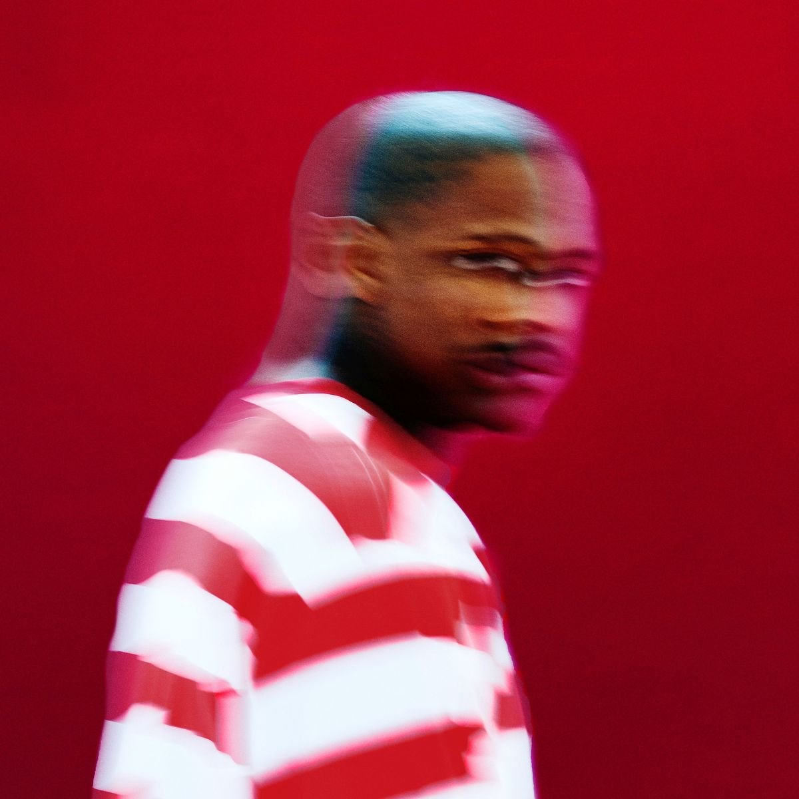

import { Slider, Button } from 'carbon-components-react';
import { ArrowUpRight24  } from '@carbon/icons-react';

import SliderJS1 from "../review/slider1"
import SliderJS2 from "../review/slider2"
import SliderJS3 from "../review/slider3"
import SliderJS4 from "../review/slider4"

import { Link } from "gatsby"

Album review

<h1 className="h1--no--margin">{props.pageContext.frontmatter.title}</h1>

<Link to="/best50/2016/">2016 Black Music Best No.16</Link>

<Row  className="image-card-group">
	<Column colMd={"3"} colLg={"4"} noGutterMdLeft="">
       <ImageCard>

 

</ImageCard>
	</Column>
	<Column colMd={"4"} colLg={"8"} noGutterMdLeft="">
	

	デビュー作がスマッシュヒットとなったYGの2作めのスタジオアルバム。Compton出身でBloodsにも所属していたという出自そのままのGファンクなアルバム。哀愁感漂うシンセをフィーチャーしたミドル-スロー曲中心の構成であり、今回は唄はなしで、よりコアなGangsta Rapに近づいている。Lyricもそちら方面がメインになる。YGのRapは前作に比べると、しっかりと力強さが増し、芯ができた気がする。ゆるいループに身を任せると癖になりそうなアルバムである
	

	

	  <Button className="button-right-mergin"  href="https://amzn.to/2PQQ38l" kind="primary" size="small" renderIcon={ArrowUpRight24}>
      amazon.com
    </Button>
	  <Button className="button-right-mergin"  href="https://amzn.to/2Y0vSJQ" kind="secondary" size="small" renderIcon={ArrowUpRight24}>
      amazon.co.jp
    </Button>
	

	
	</Column>
</Row>
<Row >
	<Column colMd={"4"} colLg={"4"} noGutterMdLeft="">
		

  		<h3>Score card</h3>
		<SliderJS1 value="1" />
  		<SliderJS2 value="2" />
		<SliderJS3 value="2" />
  		<SliderJS4 value="8" />
		

	</Column>
	<Column colMd={"8"} colLg={"8"} noGutterMdLeft="">
		

			<h3>Producers</h3>
			

				Swish(2,3,7,15)
				 P-Lo(4,16)
				 Terrace Martin(5)
				 Larrance Dopson(8,12)
				 CT Beats(9)
				 Dae Brown(11)
				 Ty Dolla Sign and Swish(14)
				 Hit-Boy(17)
			

			<h3>Guests</h3>
			

				Sad Boy, AD, Bricc Baby, Slim 400, Syke 800, Duce, Marley Blue, Burnt Out Lil Wayne, Drake, Kamaiyah, Joe Moses, jay 305, The Homegirl, Nipsey Hussle
			

		

	</Column>
</Row>

<h3>Tracks</h3>

| No. |	 Title                     |	 Composers                                                                                            |	 Performer                                      |	 Time	|
| --- |	-------------------------- | ------------------------------------------------------------------------------------------------------ | ----------------------------------------------- | ----- |
|	1	  |	Pops Hot (Intro)           |                                                                                                       	|	YG                                             	|	00:14 |
|	2	  |	Don’t Come to LA         	 | Samuel Ahana / Maria Hernandez / Keenon Jackson / Zihirr Mitchell                                     	|	YG feat. Sad Boy, AD , Bricc Baby              	|	03:35 |
|	3	  |	Who Shot Me?               | Samuel Ahana / Paloma Ford / Keenon Jackson                                                           	|	YG                                             	|	03:47 |
|	4	  |	Word Is Bond               | Vincent Cohran / Keenon Jackson / Paulo Rodriguez                                                     	|	YG feat. Slim 400                              	|	03:16 |
|	5	  |	Twist My Fingaz            | George Clinton / Keenon Jackson / Terrace Martin / Walter "Junie" Morrison / Garry Shider             	|	YG                                             	|	04:14 |
|	6	  |	Good Times Interlude       | George Clinton / Keenon Jackson / Terrace Martin / Walter "Junie" Morrison / Garry Shider             	|	YG feat. Syke 800, Duce, Marley Blue, Burnt Out	|	00:38 |
|	7	  |	Gimmie Got Shot            | Samuel Ahana / Keenon Jackson / Brandon Moore                                                         	|	YG                                             	|	02:46 |
|	8	  |	I Got a Question           | Dwayne Carter / Larrance Dopson / Keenon Jackson                                                      	|	YG feat. Lil Wayne                             	|	03:38 |
|	9	  |	Why You Always Hatin?      | Aubrey Graham / Keenon Jackson / August Moon / Clarence Thomas / Tyrone Thomas                        	|	YG feat. Drake, Kamaiyah                       	|	03:16 |
|	10	|	My Perception              | Bool, Balm & Bollective                                                                               	|	YG feat. Slim 400                              	|	00:14 |
|	11	|	Bool, Balm & Bollective    | Keenon Jackson / Terrace Martin                                                                       	|	YG                                             	|	03:35 |
|	12	|	She Wish She Was           | Jay Cummins / Larrance Dopson / Lamar Edwards / Keenon Jackson / Oscar Jackson / D'Mon Dedrick Rolison	|	YG feat. Joe Moses, jay 305                    	|	03:57 |
|	13	|	YG Be Safe                 | Bool, Balm & Bollective                                                                               	|	YG feat. The Homegirl                          	|	00:04 |
|	14	|	Still Brazy                | Samuel Ahana / William Curtis / John Flippin / Tyrone Griffin / Keenon Jackson                        	|	YG                                             	|	03:22 |
|	15	|	FDT                        | Samuel Ahana / Keenon Jackson / Oscar Jackson                                                         	|	YG feat. Nipsey Hussle                         	|	03:46 |
|	16	|	Blacks & Browns            | Maria Hernandez / Keenon Jackson / Nye Lee Jr. / Paulo Rodriguez                                      	|	YG feat. Sad Boy                               	|	04:10 |
|	17	|	Police Get Away Wit Murder | Chauncey Hollis / Keenon Jackson                                                                      	|	YG                                             	|	03:19 |
