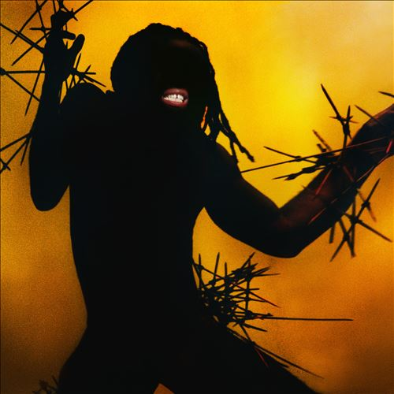

import { Slider, Button } from "@carbon/react";
import { ArrowUpRight } from "@carbon/icons-react";

import SliderJS1 from "./slider1";
import SliderJS2 from "./slider2";
import SliderJS3 from "./slider3";
import SliderJS4 from "./slider4";
import AdvJS2 from "../review/adv2";
import AdvJS3 from "../review/adv3";

import { Link } from "gatsby";

import Review1 from "../review/youngfathers2.mdx";

Album review

<h1 className="h1--no--margin">{props.pageContext.frontmatter.title}</h1>

  <Link to="/best50/2023/">2023 Black Music Best No.9</Link>

<Row  className="image-card-group">
	<Column colMd={3} colLg={4} noGutterMdLeft="">
       <ImageCard>

</ImageCard>
	</Column>
	<Column colMd={4} colLg={8} noGutterMdLeft="">
		

		Young Fathersの約5年振りとなる4作目。周りとの交流が少なく、一種独特な作風を保ってきたチームだが、そこは引き続き、維持されている。ただ、Hip-Hop, Grime色は少し薄れて、メンバー2人の出自であるAfrica音楽からの影響が色濃くなっている。これにパンクやインダストリアルっぽいロックなど様々なジャンルが加わったようなサウンドに、3人によるVocal, Chorusが加わって、まさに彼らならではのアルバムとなっている。制作もメンバー中心で、ちょっとローファイなところもあるが、アップで高揚感の感じられる曲も多い。
		

		

		  <Button className="button-right-mergin"  href="https://amzn.to/48gxhNR" renderIcon={ArrowUpRight} size='sm' kind='primary'>
  	    amazon.com
  	  </Button>
		  <Button className="button-right-mergin"  href="https://amzn.to/48j1r32" renderIcon={ArrowUpRight} size='sm' kind='secondary'>
  	    amazon.co.jp
  	  </Button>
			<Button className="button-right-mergin"  href="https://apple.co/3GFPNUa" renderIcon={ArrowUpRight} size='sm' kind='tertiary'>
  	    apple music
  	  </Button>
			<AdvJS2/>
		

		</Column>
</Row>
<Row >
	<Column colMd={4} colLg={4} noGutterMdLeft="">
		

  		<h3>Score card</h3>
			<SliderJS1 value="5" />
  		<SliderJS2 value="2" />
			<SliderJS3 value="1" />
  		<SliderJS4 value="8" />
		

	</Column>
	<Column colMd={8} colLg={8} noGutterMdLeft="">
		

			<h3>Producers</h3>
			

				G. Hastings(all)
			

			<h3>Guests</h3>
			

			

		

	</Column>
</Row>

<h3>Tracks</h3>

| No. | Title         | Composers                                                                 | Performer     | Time  |
| --- | ------------- | ------------------------------------------------------------------------- | ------------- | ----- |
| 1   | Rice          | Kayus Bankole / Graham "G" Hastings / Alloysious Massaquoi                | Young Fathers | 02:40 |
| 2   | I Saw         | Kayus Bankole / Graham "G" Hastings / Alloysious Massaquoi                | Young Fathers | 03:27 |
| 3   | Drum          | Kayus Bankole / Graham "G" Hastings / Alloysious Massaquoi                | Young Fathers | 03:38 |
| 4   | Tell Somebody | Kayus Bankole / Graham "G" Hastings / Alloysious Massaquoi                | Young Fathers | 03:10 |
| 5   | Geronimo      | Kayus Bankole / Graham "G" Hastings / Alloysious Massaquoi                | Young Fathers | 03:33 |
| 6   | Shoot Me Down | Kayus Bankole / Graham "G" Hastings / Alloysious Massaquoi                | Young Fathers | 03:28 |
| 7   | Ululation     | Kayus Bankole / Graham "G" Hastings / Tapiwa Mambo / Alloysious Massaquoi | Young Fathers | 02:53 |
| 8   | Sink or Swim  | Kayus Bankole / Graham "G" Hastings / Alloysious Massaquoi                | Young Fathers | 03:04 |
| 9   | Holy Moly     | Kayus Bankole / Graham "G" Hastings / Alloysious Massaquoi                | Young Fathers | 03:29 |
| 10  | Be Your Lady  | Kayus Bankole / Graham "G" Hastings / Alloysious Massaquoi                | Young Fathers | 03:16 |

<h3>Other Reviews</h3>

<Row>
  <Column colMd={3} colLg={3} noGutterMdLeft>
    <Review1 />
  </Column>
</Row>

<AdvJS3 />
