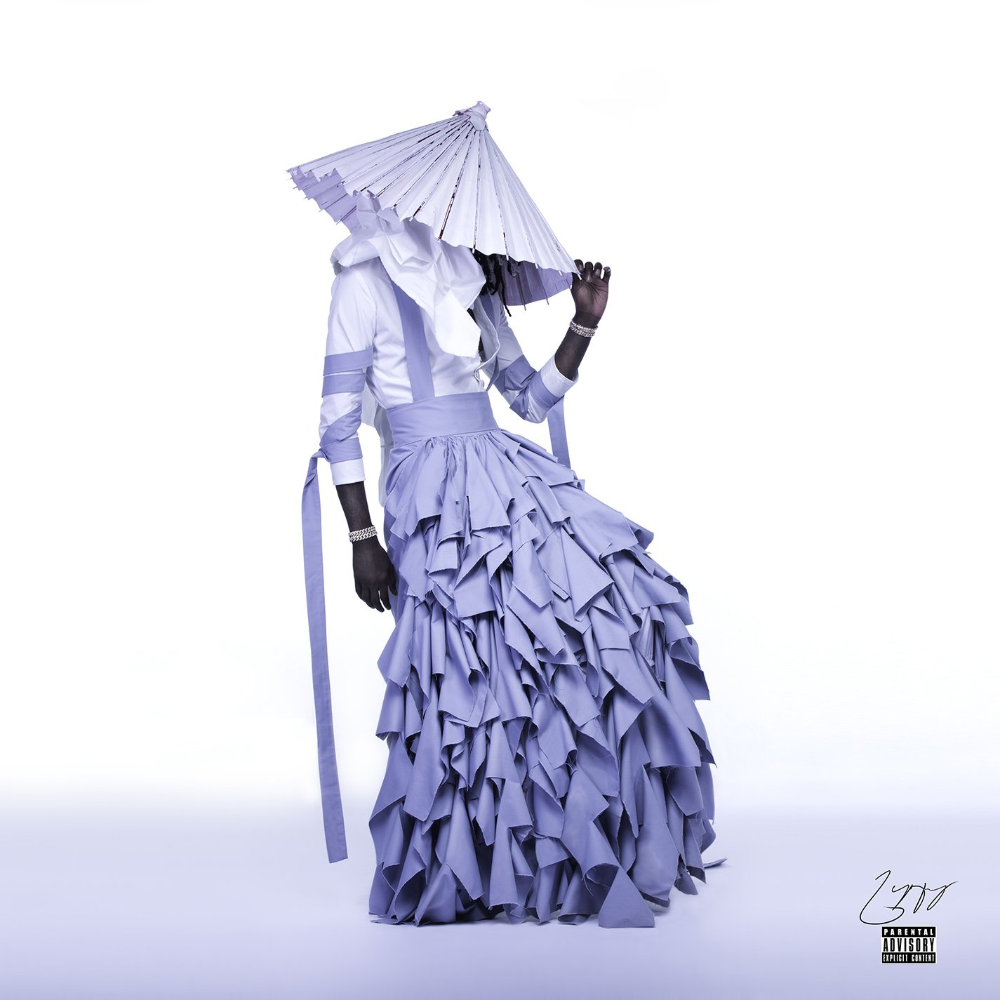

import { Slider, Button } from 'carbon-components-react';
import { ArrowUpRight24  } from '@carbon/icons-react';

import SliderJS1 from "../review/slider1"
import SliderJS2 from "../review/slider2"
import SliderJS3 from "../review/slider3"
import SliderJS4 from "../review/slider4"

import { Link } from "gatsby"

Album review

<h1 className="h1--no--margin">{props.pageContext.frontmatter.title}</h1>

<Link to="/best50/2016/">2016 Black Music Best No.14</Link>

<Row  className="image-card-group">
	<Column colMd={"3"} colLg={"4"} noGutterMdLeft="">
       <ImageCard>

 

</ImageCard>
	</Column>
	<Column colMd={"4"} colLg={"8"} noGutterMdLeft="">
	

	2016年夏にリリースされたYoung ThugのMixtape。アルバムタイトルのJefferyというのは本人のFirst Name。全曲、実在の人物(但し、Harambeは悲劇のゴリラの名前)を曲名としている。全体的にはサウスマナーの哀愁を帯びたスローな曲が多く、Raggae, Dubの影響も受けている印象で、その上にいつもの甲高いYoung Thugの唄うようなRapが乗っかている。ジャケット写真の本人による女装は大阪のファッションスクールに在籍したデザイナーによるもので、番傘をかぶっているのはそのためのようだ。男尊指向のHip-Hop界に一石を投じている人でもある。
	

	

	  <Button className="button-right-mergin"  href="https://amzn.to/31V9HFV" kind="primary" size="small" renderIcon={ArrowUpRight24}>
      amazon.com
    </Button>
	  <Button className="button-right-mergin"  href="https://amzn.to/2PTSCXx" kind="secondary" size="small" renderIcon={ArrowUpRight24}>
      amazon.co.jp
    </Button>
	

	
	</Column>
</Row>
<Row >
	<Column colMd={"4"} colLg={"4"} noGutterMdLeft="">
		

  		<h3>Score card</h3>
			<SliderJS1 value="1" />
  		<SliderJS2 value="1" />
			<SliderJS3 value="2" />
  		<SliderJS4 value="8" />
		

	</Column>
	<Column colMd={"8"} colLg={"8"} noGutterMdLeft="">
		

			<h3>Producers</h3>
			

				TM88, Supah Mario(1)
				 Jeffery Williams. TM88, Wheezy, Goose, Billboard Hitmakers(2)
				 Wheezy(3)
				 TM88, Supah Mario(4)
				 Billboard Hitmakers(5,7,8)
				 Wheezy, Cassius Jay(9
			

			<h3>Guests</h3>
			

				Travis Scott, Gucci Mane, Gunna, Quavo, Offset, Young Scooter, Duke, Wyclef Jean
			

		

	</Column>
</Row>

<h3>Tracks</h3>

| No. |	 Title                                                          |	 Composers                                                                                                                           |	 Performer                                         | Time	 |
| --- |	--------------------------------------------------------------- | ------------------------------------------------------------------------------------------------------------------------------------ | --------------------------------------------------- | ----- |
|	1	  |	Wyclef Jean                                                    	| Jeffery Williams, Bryan Simmons, Jonathan Priester                                                                                   | Young Thug                                          | 03:56 |
|	2	  |	Floyd Mayweather (featuring Travis Scott, Gucci Mane and Gunna)	| Bryan Simmons, Wesley Glass, Devante Wilkes, Eduardo Burgess, Jr., Jonathan De La Rosa, Javin Andrews, Jacques Webster, Radric Davis | Young Thug feat. Travis Scott, Gucci Mane and Gunna | 06:01 |
|	3	  |	Swizz Beatz                                                    	| Jeffery Williams, Wesley Glass                                                                                                       | Young Thug                                          | 03:16 |
|	4	  |	Future Swag                                                    	| Jeffery Williams, Bryan Simmons, Jonathan Priester                                                                                   | Young Thug                                          | 02:45 |
|	5	  |	RiRi                                                           	| Jeffery Williams, Eduardo Burgess, Jr., Jonathan De La Rosa                                                                          | Young Thug                                          | 04:04 |
|	6	  |	Guwop (featuring Quavo, Offset and Young Scooter)              	| Jeffery Williams, Wesley Glass, Bryan Simmons, Joshua Cross, Quavious Marshall, Kiari Cephus, Kenneth Bailey                         | Young Thug feat. Quavo, Offset and Young Scooter    | 05:15 |
|	7	  |	Harambe                                                        	| Jeffery Williams, Eduardo Burgess, Jr., Jonathan De La Rosa                                                                          | Young Thug                                          | 03:10 |
|	8	  |	Webbie (featuring Duke)                                        	| Jeffery Williams, Eduardo Burgess, Jr., Jonathan De La Rosa, Arnold Martinez                                                         | Young Thug feat. Duke                               | 03:55 |
|	9	  |	Kanye West (featuring Wyclef Jean)                             	| Jeffery Williams, Wesley Glass, Joshua Cross, Wyclef Jean                                                                            | Young Thug feat Wyclef Jean                         | 05:41 |
